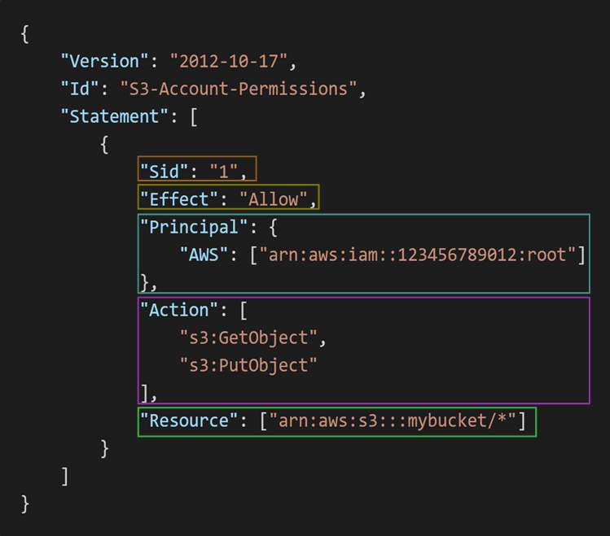

# Identity And Access Management

## Introduction to IAM 

- IAM stands for Identity Access Management which is a global service in AWS which means it is available in every region.

- Generally we use IAM, when we have actually created our account in AWS. I mean when you create an aws account, you actually create a root account which we doesn't use basically. Because root account has all the privilages (permissions) for using all the services in the aws. So to limit the access to enitre AWS, we actually create Users.

- IAM Users are actually people within our organization and we can group them. Suppose consider we have a company which is building a product and we are using aws services to serve these product to end users. So to build this product we need developers team, operations team, audit team, testing team and so on. 

- Since we are serving application via AWS, so we need to have an account in AWS. So we have give access of that account to everyone in your oranization. So this organization initially create an businees account in AWS which is called Root Account which has access to all the services in AWS.

- But organization cannot able to give access of this root account to everyone in the organization as if anyone might use an unneccessary service which is not used in the development of the product might cost a lot for organizations. So they thought, they will create an <b>IAM User</b> account for each person in the organization and give that credentials to each person in the organization.

- Later they group those users into multiple groups by using <b>IAM Groups</b> such as developers group, operations group, audit group etc as users in each group do similar tasks. Till now these users doesn't have any permissions to access the aws account. They can just login into that aws account and cannot do anything. 

- Now, organization starts giving permissions to Users or Groups for accessing services in AWS account. So Organization assigns a JSON documents to Users or Groups which are called as <b>Policies</b>.

- These policies define the permissions of the Users or Groups. Usually organizations apply least privilage principle which means they don't give more permissions than an User or Group needs.

- So IAM Users are considered as people in a oganization and Group is Users considered same class such as developers team, operations team, Audit team etc. Groups can contain only Users not other groups. Users do or don't have to belong a group and a single user can belong to multiple groups. IAM policies are defined to give permissions to users.

- **Note** : Generally we cannot login multiple Aws Accounts in same browser in previous days. But now, AWS given a new few feature called multi-session support through which we can login multiple aws accounts on same browser. To enable this feature, just click on account id in aws console, there you can see an option called `Turn on multi-session support`, then you can see an `Add session` option when you click on account id. Now click on `Add Session` button, then you can get a new login page where you can login into new account.

## IAM Policies

- As we know IAM policies are defined to give permissions to the users. We can give permissions to users in two ways. Users would inherit permissions from the groups itself. This means what ever permissions that are attached to the groups, those gets inherited to the users also.

- We can directly attach a policy to an user which is called inline policy. We have two ways to create an inline policy. Those are Visual Method and JSON Method. Before going to understand these methods lets first see whats the structure of a policy in AWS.

- Policy Structure consists of the following things.

  **Version** : This is the policy language version, always include "2012-10-17"

  **Id** : It is an identifier for the policy which is optional.

  **Statement** : One or more individual statements (required). A statement actually consists the following things.

    1. **Sid** : It is an identifier for the statement (optional)

    2. **Effect** : Whether statement allows or denies the access (only two options Allow or Deny)

    3. **Principal** : It is account/user/role to which this policy is applied to.

    4. **Action** : List of actions this policy allow or denies. If it says `*` mark then it means everything.

    5. **Resources** : List of resources to which policy is applies to.

    6. **Conditions** : Conditions for when this policy is in effect. (optional)

  Sample Policy structure is shown in the following image.

  

  
   
  <em>Policy Structure</em>
  
  

- For creating the policies like above we have visual and json methods. In visual method which is an graphical interface method, where we just have to select the Effect, Actions and Resources from the dropdown list. Once you selected these options then policy gets automatically created. Whereas in JSON method, we have to edit these Effect, Actions, Resources in JSON object by selecting the options from search bar beside each key.

## IAM MFA

- Till now, we have seen how to create Users, Groups, and define Policies to Users and Groups. Now lets see how to protect the accounts of the root and IAM Users.

- We have two mechanisms to protect the root and IAM User accounts. Those are Password Policy and MFA.

- **Password Policy** : Creating Stronger passwords provides high security for the account. In AWS, we can setup our own password policy. We can set minimum password length. We can set required specific charecter types such as including uppercase letters, lowercase letters, numbers, non-alphanumeric charecters. And we can also setup some mor options such as Allow all IAM Users ti change their own passwords, set passowrd expiration sate which means users need to change their password after sometime and prevent password reuse. To do this go to IAM service and click on Account Settings on the Left side list of options. Then Click on Edit button in Password Policy section then select custom password policy and then setup your own password policy.

- **MFA** : MFA stands for Multi-Factor Authentication which is an anothor option to protect our Root and IAM User account. MFA is nothing but password + security device we own. If enable multifactor authentication then we need to enter our password and the key that is generated by security device that we actually own. So even password gets hacked, we couldn't lose our account as they doesn't know the key generated by security device. So password + Security Key results successful login. MFA devices supported by AWS are <b>Virtual MFA Device</b> (Google Authenticator, Authy which are apps used in phone) which supports multiple tokens on single device, <b>Universal 2nd Factor (U2F) Security Key</b> (Yubikey by Yubico (3rd party)) which supports for multiple root and IAM users using a single hardware security key. It is actually a chip. We have to insert this chip to our device where we are logging the AWS account. We have two more MFA devices but those are also hardwore devices but generate Keys such as <b>Hardware Key Fob MFA Device</b> provided by Gemalto, <b>Hardware Key Fob MFA Device For AWS GovCloud</b> provided by SurePassID.

## Accessing AWS Services

- There are actually three ways we can access the AWS services. Those are AWS Management Console (which is protected by the password + MFA), AWS Command Line Interface (CLI) (which is protected by access keys), AWS Software Development Kit (SDK) (which is protected by Access keys).

- Till now, we have seen accessing AWS Services using AWS Management Console. But we have other two ways which are listed above. But to access the services using CLI and SDK, we need access keys. Access keys are actually generated by using AWS Console. Users manage their own access keys. An Access key has two things those are Acess Key ID, Secret Access Key. Access Key ID is like Username and Secret Access Key is like password.

- AWS CLI is a tool that enables you to access the AWS services using commnads in your command line shell. Using CLI, you have direct access to public APIs of AWS Services. You can develop scripts to manage your resources. CLI is open source and can be used as alternative to the AWS Management Console.

- AWS SDK is a Software Development Kit which has language specific APIs (means Language specific set of libraries) that enables you to access and manage the AWS Services programatically. AWS SDK is embedded within our application. AWS SDK supports many languages such as JavaScript, Python, PHP, .NET, etc , it has Mobile SDKs such as Android, IOS etc and it has IOT Device SDKs such as Embedded C, Arduino etc.

- Now lets access the aws services using AWS CLI. To do this first we need to download the AWS CLI installer from the internet and then run that installer on our computer. After this check whether aws cli is properly executed or not by using `aws --version` command. Once we installed the CLI successfully now we need to get the credentials to configure the cli with our account. These credentials are called Access Keys.

- To create access keys, first login in to the aws management console and open IAM service. Then click on that username under users section then you can see 5 sections such as permissions, groups, tags, security credentials, last accessed etc. Now click on the security credentials and then click on create access key button. Now select command line interface and then click next. Now it shows to enter a tag for that access key but it is optional. So click create access key, then the access key gets created. Now download the .csv file which contains access keys id and secret access key.

- Now open the terminal or command prompt and run `aws configure` command. Now it asks for Access Key ID, Secret Access Key ID, Region and output. So enter the respective field answers and leave empty for output format field. Now you can access the services that can be accessed by an IAM User using management console. If that user IAM full access then run this command `aws iam list-users` which gives all the users present in the root account. This is how we access the services of AWS using AWS CLI.

- AWS provides an alternative for AWS CLI which is called CloudShell. It is actually a cloud terminal environment similar to CLI. If you doesn't want to setup and configure the AWS CLI in your own computer, then we can use these CloudShell service. This CloudShell is located in top right corner of AWS Management Console.

## IAM Roles

- In Real world situations, some AWS services will need to perform some actions on your behalf. For example if you training a model in AWS and data is stored in S3, then Ec2 has to fetch the data from S3 and use that data to train the model. To do this Ec2 must has an access on S3 to fetch the data from it. 

- For this we have to create a role for an ec2 by attaching full access of s3 policy to it. Once we created that role then we can attach this role to that particular Ec2 instance where we are training our model.

- To create a role, first open the IAM service and then click on the roles button in the left side of IAM service interface. Then click on the create role button. After that we have to choose the service for which we want to create a role and then we have to attach a policy to that role and then name the role and then click on the create role button. Once you created the role, now we have to attach that role to the service that you want to perform on behalf of you.

- Common Roles are Ec2 Instance Roles, Lambda Function Roles, Roles for Cloud Formation.

## IAM Security Tools

- Securing the root and user account is crucial for an organization. So we have to monitor all user accounts and root account continuosly so that no account gets hacked. 

- So track all users accounts such as when they have last accessed, when they have changed the password and what services that user is accessing and what polices are allowing to access particular services, IAM provides two useful security tools. Those are Credentials Report and Access Advisor.

- **Credentials Report** : Credentials Report provides an excel sheet which contains all the user information in that organization such as name of all users, when they have last accessed the account, when they have last changed the password and how frequently they are accessing the account, and in which medium they are accessing the account such as Management Console or CLI etc. By using this report we can monitor all users accounts. To generate this report, open the IAM service and then click on credentials report on left hand side under Access Reports section.

- **Access Analyzer** : Access Analyzer provides the list of services that can access a particular user and also gives the information about when a particular sevice has been accessed by that user and also gives the list of services that hasn't been accessed by that user yet. We can also know which policy is granting permissions to the user for accessing that services. Through this we can acess that  for which services that we need to give permissions for this user and for which services we need to remove permissions etc. By using the Access Analyzer we can follow that least privilage principle.

## IAM Best Practices

- Use Root account only when AWS Account Setup and later user only IAM User.

- One physical user is equivalent to one IAM User only. If you want to provide access of AWS account to your friend then don't share your credentials instead just create anothor user in the name of your friend and share those credentials only.

- Create groups and add users to these groups and attach policies to groups itself instead of attaching the inline policies.

- Create and use IAM Roles if you want to do a particular task by other AWS Services on behalf of yours.

- Use Access Keys if you want to access AWS Services programatically (CLI or SDK).

- Audit the AWS Accounts by using Credentials Report and AWS Access Analyzer.

## Summary of IAM

- IAM stands for Identity And Access Management is a free global service that securely manages the access of AWS Services by controlling who is authenticated and authorized. (Or) we can say AWS Identitiy And Access Management provides the infrastructure necessary to control the authentication and authorization of your AWS Accounts. It allows administrators to create users, groups, roles and applying policies to enforce the priciple of least privilage.

- We have actually 3 AWS Identities. Those are IAM Users, IAM User Groups, IAM Roles. <b>IAM Users </b> are actually people in the organization. Organizations usually creates seperate IAM User Account for each employee working under them. So we can say  each IAM User are one physical user or employee in the organization. 

- <b>IAM User Groups</b> are similar to groups in an organization which consists of multiple users and they actually perform particular tasks only. So we can group multiple IAM Users into groups by using IAM User Groups.

- <b>IAM Roles</b> gives a set of permissions to the AWS services to perform particular actions on behalf of that IAM User or ourselves. Generally in many applications we have to provide some permissions to AWS services to perform actions on behalf of ourselves. To do this we use IAM Roles.

- <b>IAM Policies</b> are actually JSON documents that define the permissions to the AWS Identities such as IAM Users, User Groups, Roles. We have predefined policies in AWS or we create our own policy also. To create our own policies we should know the policy structure. IAM Policies actually includes the following things.

  **Version** : It states the version of the policy. Generally the policy version is "2012-10-17".

  **Id** : It is policy Id which is used to identify the policy.

  **Statement** : Statement is actually one that define the permissions in that policy. We can have one or multiple statements in a policy. A statement includes the following things.

  1. **Sid** : Sid is statement id which is used to identify the statement.
  2. **Effect** : It actually tells whether policy allows or denies the below actions.
  3. **Principle** : It is account/user/role to which policy is applied to.
  4. **Action** : It is list of actions that policy allows or denies.
  5. **Resources** : It is the list of resources to which the policy is applied to.
  6. **Conditions** : Conditions when the policy is on Effect.

- There are actually two ways to secure the AWS Accounts in an organization. First one is enforcing a strong password using Password Policy. Second one is using MFA as additional protection.

- AWS allows us to edit the default password policy to enforce strong password. We can include the follwing things in the password policy. Those are Setting the length of the password, including uppercase, lowercase letters, numbers, special charecters, etc. We can also set password expiration and prevent password reuse or we can enforce users to change the password for each login etc. These are things that we can include in the password policy to enforce stong password for enhancing the security of our AWS Account.

- Along with password policy, AWS provides anothor mechanism which is Multifactor authentication. MFA is simply Password + MFA Device or token generated from MFA device. So login into AWS account we need both password and MFA device. Even our password gets hacked, they need our MFA device to access our AWS account. So MFA actually provides more security to our AWS account. We have both physical and Virtual MFA devices.

- For Monitoring the AWS accounts, we have two services that is provided by IAM. Those are IAM Credentails Report and IAM Access Advisor.<b>IAM Credentials Report</b> provides generates an excel sheet by providing the account level information which includes list of AWS Users Accounts in the organization and the status of each user such as when they have last accessed, access keys of each user etc.

- <b>IAM Access Advisor</b> provides an User Level Information which provides the service permissions granted to each user and when they have last accessed. You can use this information to revise the policies of that user to enforce the principle of least privilage.

- There are actually three ways to access the AWS services. Those are AWS Management Console, AWS CLI and AWS SDK. AWS Mangement Console is an Web service which provides graphical user interface to access the AWS Services and this console is protected by Username and Password.

- <b>AWS CLI</b> is a command line interface which uses commands to access the AWS Services. It directly uses the public APIs of the AWS Services via commands. <b>AWS SDK</b> is a Software Development Kit which is a set of libraries that are used to access the AWS Services programatically. These two are protected by the Access Keys.
